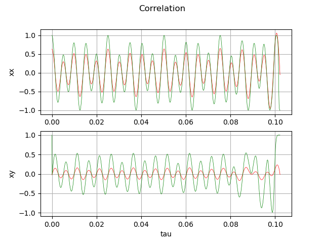

Завдання на лаб. роботу 2: використати вбудовані функції бібліотек мови python для обрахування автокореляції, порівняти з роботою програми.

Червоний граф це робота оригінальної програми, зелений це робота вбудованих функцій.

 

